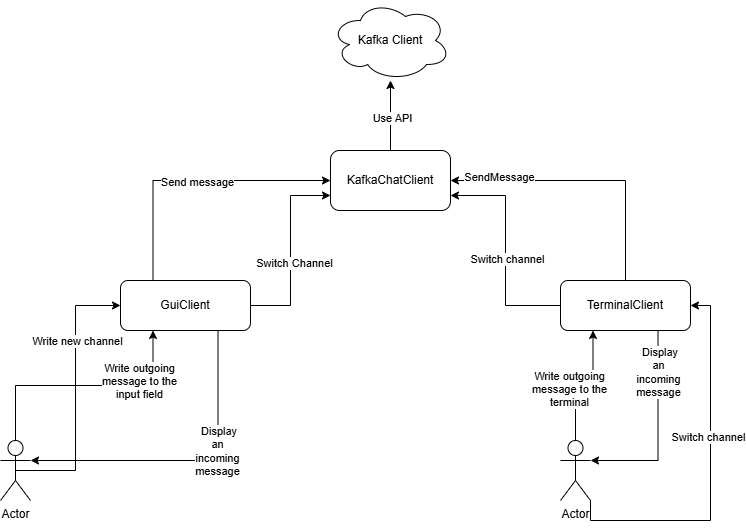

## Архитектура



### Описание компонентов

#### #### KafkaChatClient


KafkaChatClient — это класс, реализующий абстракцию "чат-клиента", который взаимодействует с Apache Kafka.

* Подключение к Kafka-брокеру

* Подписка на канал

* Отправка сообщения в канал

* Получение новых сообщений из канала и передача их в обработчик (callback)

* Хранение актуального канала и переключение между каналами

Реализует интерфейс:

```python
def __init__(self, bootstrap_server: str, initial_channel: str, username: str, income_message_callback: Callable)

def send_message(self, message: str)

def switch_channel(self, new_channel: str)

```

#### GuiClient

Принимает пользовательские команды из GUI (ввод сообщение, нового канала) и вызывает методы  `KafkaChatClient`

#### TerminalClient

Принимает команды из терминала (ввод сообщение, команду смена канала) и вызывает методы  `KafkaChatClient`


### Структура проекта

`bin/` - точки входа клиентов
    * `bin/gui_main.py` - точка входа клиента для UI
    * `bin/terminal_main.py` - точка входа клиента для терминала

`lib/` - внутренние файлы проекта, содержит имплементации KafkaChatClient, GuiClient, TerminalClient

`tests/` - файлы с тестами